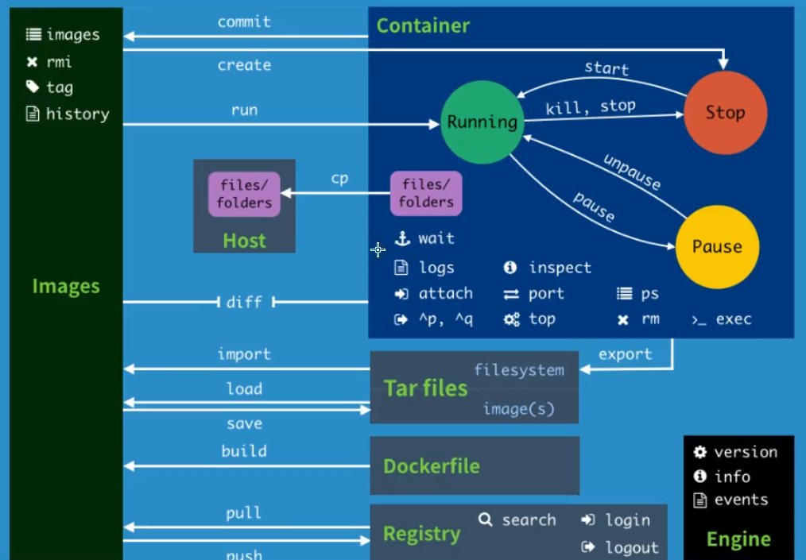
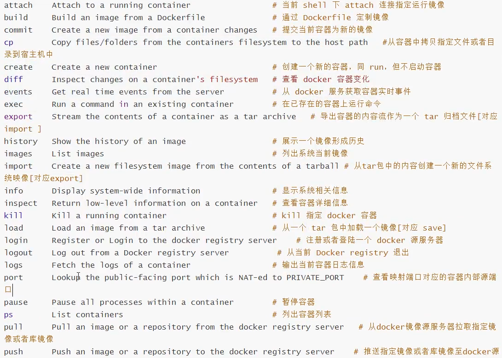
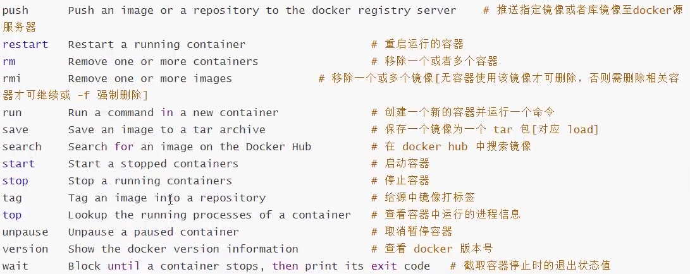

# Docker常用命令

```dockerfile
# 命令的帮助文档地址
https://docs.docker.com/reference/


# 查看docker 版本
docker version

# 查看docker 系统信息，包含镜像数量以及容器数量
docker info

# 帮助命令
docker 命令 --help
```

1. 镜像命令

   1. `docker images`

   ```dockerfile
   # 查看所有本地的主机上的镜像 https://docs.docker.com/engine/reference/commandline/images/
   docker images
   
   # REPOSITORY  TAG  IMAGE ID  CREATED  SIZE
   # REPOSITORY 镜像的仓库源
   # TAG        镜像的标签
   # IMAGE ID   镜像的ID
   # CAEATED    镜像的创建时间
   # SIZE       镜像的大小
   
   # 可选内容
   # -a, --all   列出所有镜像
   # -q, --quiet 只显示镜像的ID
   ```

   2. `docker search`

      ```dockerfile
      # 搜索镜像
      docker search 镜像名
      
      #NAME  DESCRIPTION  STARS  OFFICIAL  AUTOMATED
      
      # 可选项 通过条件来过滤
      # --filter=STARS=3000 搜索STARS大于3000的
      ```

   3. `docker pull`

      ```dockerfile
      # 下载镜像，没有tag参数，默认下载最新版
      docker pull 镜像名 
      
      # docker镜像的核心 分层
      # 等价于 docker pull docker.io/libarary/镜像名:版本号
      
      # 指定版本下载
      docker pull 镜像名:版本号
      ```

   4. `docker rmi `

      ```dockerfile
      # 删除镜像
      docker rmi -f  镜像名/镜像ID
      
      # 删除多个
      docker rmi -f  镜像名/镜像ID 镜像名/镜像ID 镜像名/镜像ID
      
      # 删除全部镜像
      docker rmi -f $(docker images -aq)
      # $()传参作用
      ```

      

2. 容器命令

   **有了镜像才可以有容器**

   1. `docker run`

      ```dockerfile
      # 创建容器
      # docker run [可选参数] 镜像名
      docker run image
      
      # 可选参数
      # --name-"name"    设置容器名字
      # -d               后台方式运行
      # -it              使用交互方式运行，进入容器查看内容
      
      # -p               指定容器的端口 -p 8080:8080
      #        -p ip:主机端口:容器端口
      #        -p 主机端口:容器端口 (常用)
      #        -p 容器端口
      #        容器端口
      
      # -P               随机指定端口
      
      # 测试 启动并进入容器
      docker run -it centos /bin/bash
      
      # 从容器中退出到主机中
      exit
      # 第二种方式
      # Ctrl + P + 
      ```

   2. `docker ps`

      ```dockerfile
      # 查看当前运行的容器
      docker ps 
      
      # 可选参数
      # -a 列出当前运行的容器+历史运行过的容器
      # -n=? 显示最近创建的容器 n=? 数量
      # -q 只显示容器的编号
      ```

   3. `docker rm`

      ```dockerfile
      # 删除容器
      docker rm 容器ID
      
      # 删除所有的容器 -f 强制删除
      docker rm -f $(docker ps -aq) 
      
      #通过管道符进行删除
      docker ps -a -q|xargs docker rm
      ```

   4. `docker start` 

      ```dockerfile
      # 启动容器
      docker start 容器id
      
      #重启容器
      docker restart 容器ID
      
      #停止当前正在运行的容器
      docker stop 容器ID
      
      #强制停止当前容器
      docker kill 容器ID
      ```

3. 常用的其他命令

   1. `docker run -d`

      ```dockerfile
      # 通过镜像创建容器并后台启动
      docker run -d 镜像名
      
      # 查看运行时，会发现容器停止了
      # 常见问题:容器若使用后台运行，必须要有一个前台进程，否则发现没有对外提供的应用，则会自动停止
      ```

   2. `docker logs`

      ```dockerfile
      # 查看容器当前所有日志
      docker logs 镜像ID
      
      # 参数
      # -f 实时显示日志
      # -t 日志的日期
      # --tail n 查看最后第n条日志
      ```

   3. `docker top`

      ```dockerfile
      # 查看容器进程信息
      docker top 容器ID
      ```

   4. `docker inspect`

      ```dockerfile
      # 查看容器内部信息
      docker inspect 容器ID
      ```

   5. `docker exec`

      ```dockerfile
      # 容器一般是后台运行，需要进入容器进行配置
      # 进入容器
      # 命令1 进入容器后，打开新的终端
      docker exec -it 容器id/容器名 bashSell
      # 命令2 进入容器正在执行的终端，不会启动新的终端
      docker attach 容器id
      ```

   6. `docker cp`

      ```dockerfile
      # 从容器内拷贝文件到主机上 不用管容器是否运行
      # 拷贝是手动进行 
      docker cp 容器id:容器内路径 目标主机路径
      
      #从主机拷贝文件到容器
      docker cp 目标主机路径 容器id:容器内路径
      
      ```

4. 总结

   

   

   

   

