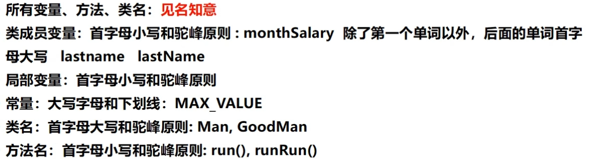

# 变量

> 变量作用域

1. 类变量

   ```java
   // 需要加 static
   ```

2. 实例变量

   ```java
   // 存在类里面，在方法外面;从属于对象;
   // 在方法内使用必须要实例化对象
   // 变量类型 变量名字 = new 类;
   ```

3. 局部变量

   ```java
   // 在方法里面定义；必须声明和初始化值；
   // 可直接使用
   ```


> 常量

```shell
# 常量使用 final 常量名(大写)=值;
```


> 命名原则



